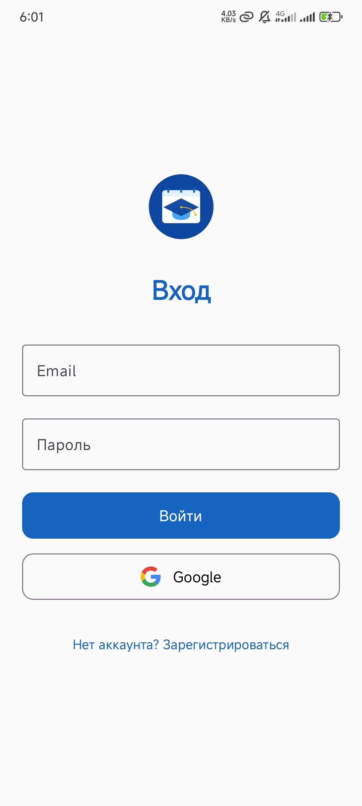
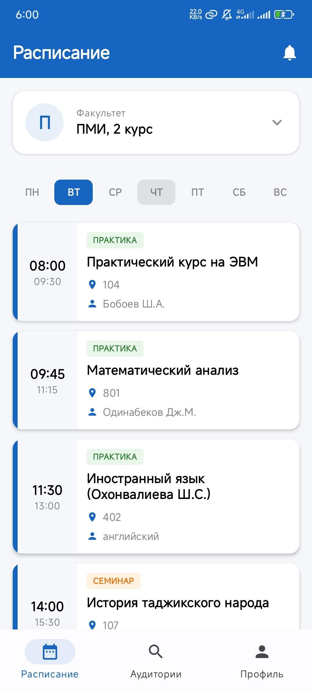
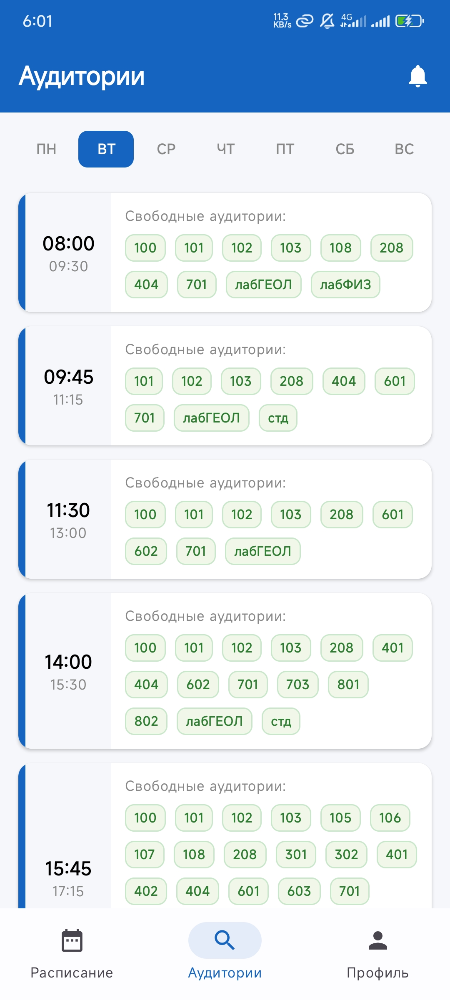
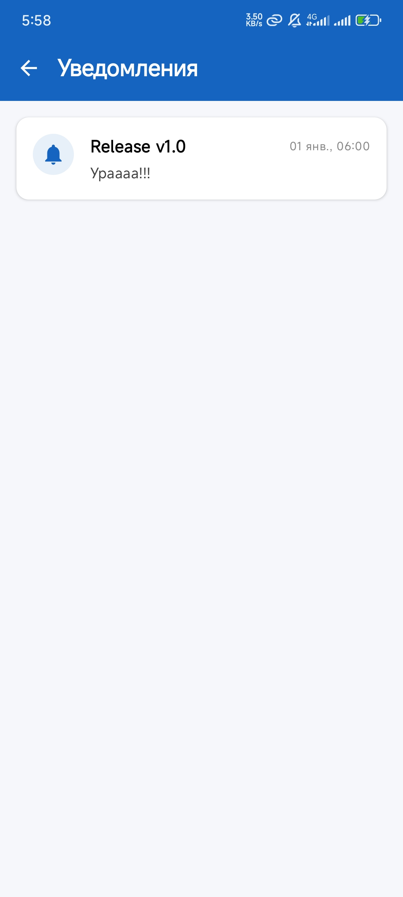

# 🎓 MSU TJ - University Schedule App


**MSU TJ** is a comprehensive mobile application for the Lomonosov Moscow State University (Dushanbe Branch). It empowers both **Students** and **Teachers** with real-time schedule tracking, smart classroom finding, and instant university alerts.

<p align="center">
  <a href="https://github.com/yusufjon-developer/msu-tj-android/releases/tag/v2.0.0">
    
  </a>
</p>

## ✨ Key Features (v2.0.0)

* **👥 Role-Based Experience:**
    *   **Students:** Instant access to group schedules and faculty news.
    *   **Teachers:** Personalized dashboard with teaching load and topic-based notifications.
* **📅 Advanced Scheduling:**
    *   **Next Week Preview:** Toggle to view the upcoming week's schedule in advance.
    *   **Swipe Navigation:** Easily switch between days of the week.
* **🏫 Smart Free Classrooms:** Find available auditoriums filtered by specific time slots and window periods.
* **🔄 In-App Updates:**
    *   Beautiful **Full-Screen Update Hub** prevents you from missing critical versions.
    *   Supports forced (critical) and optional updates.
* **👤 Enhanced Profile:**
    *   Full 3-line name display (Surname, Name, Patronymic).
    *   **Direct Editing:** Fix typos or update your details directly within the app.
* **🔔 Intelligent Notifications:**
    *    targeted alerts based on your role (Student Group or Teacher Staff).

## 📱 Screenshots

|               Authentication               |                   Schedule                    |                   Free Rooms                   |                   Notifications                    |
|:------------------------------------------:|:---------------------------------------------:|:----------------------------------------------:|:--------------------------------------------------:|
|  |  |  |  |

## 🛠 Tech Stack

### Android App (Client)
* **Language:** Kotlin
* **UI:** Jetpack Compose (Material Design 3)
* **Architecture:** Clean Architecture + MVI (Model-View-Intent)
* **DI (Dependency Injection):** Koin
* **Concurrency:** Kotlin Coroutines & Flow
* **Navigation:** Jetpack Navigation Compose

### Backend Service (Go)
* **Language:** Golang
* **Purpose:** Parsing schedule XLS files, managing data consistency, and dispatching FCM payloads.
* **Integration:** Firebase Admin SDK.

### Cloud Services (Firebase)
* **Authentication:** Secure Email/Password & Google Sign-In.
* **Realtime Database:** Stores live schedule data (Current & Next Week).
* **Cloud Firestore:** User profiles, roles, and subscriptions.
* **Cloud Messaging (FCM):** Targeted push notifications.

## 🏗 System Architecture

The project follows an **Event-Driven Architecture**:

1.  The **Go Backend** parses schedule files -> Updates **Firebase Realtime DB**.
2.  The **Android App** observes data via `Flow` and updates the UI instantly.
3.  **Cloud Functions** monitor changes and trigger **FCM** notifications to specific topics (`faculty_course` or `teachers`).
4.  The **Android App** receives the push and handles deep linking or data refresh.

## 🚀 Getting Started

### 1. Android Client
1.  Clone the repository:
    ```bash
    git clone https://github.com/yusufjon-developer/msu-tj-android.git
    ```
2.  **Prerequisite:** Place your `google-services.json` in the `app/` directory.
3.  Open in Android Studio and sync Gradle.
4.  Run on device/emulator.

### 2. Go Backend
*   Repository: [msu-tj-backend](https://github.com/yusufjon-developer/msu-tj-backend)
*   Requires `serviceAccountKey.json`.

## 📄 License

This project is distributed under the MIT License. See the [LICENSE](LICENSE) file for more details.
