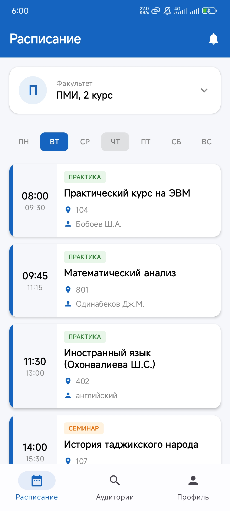
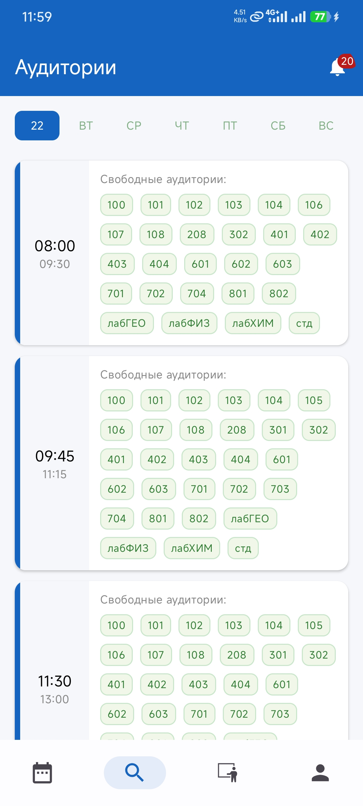
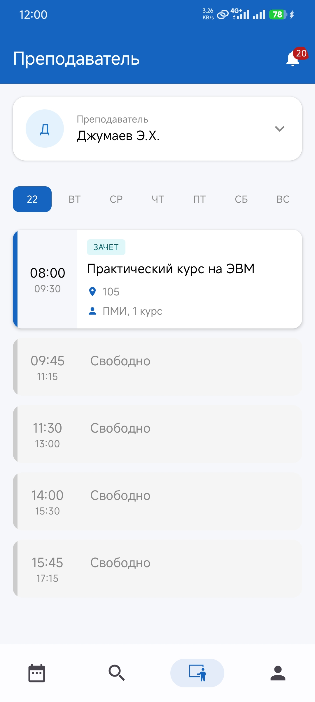
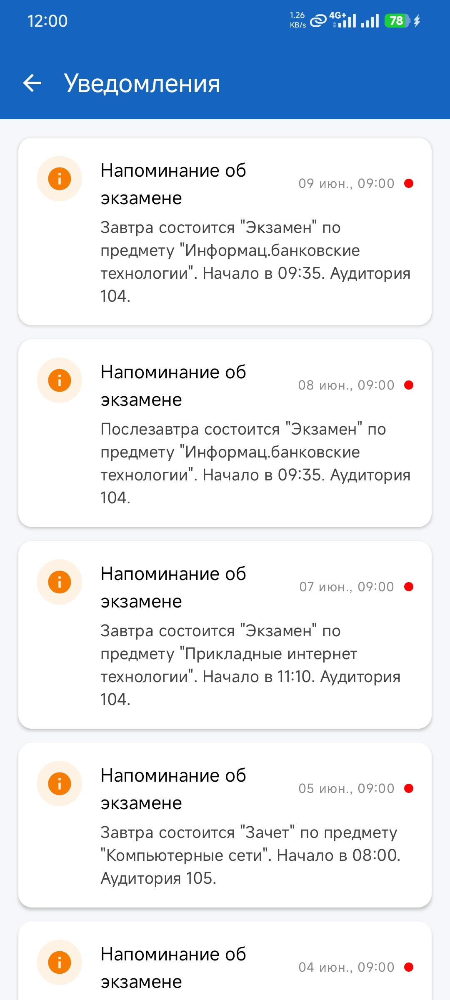
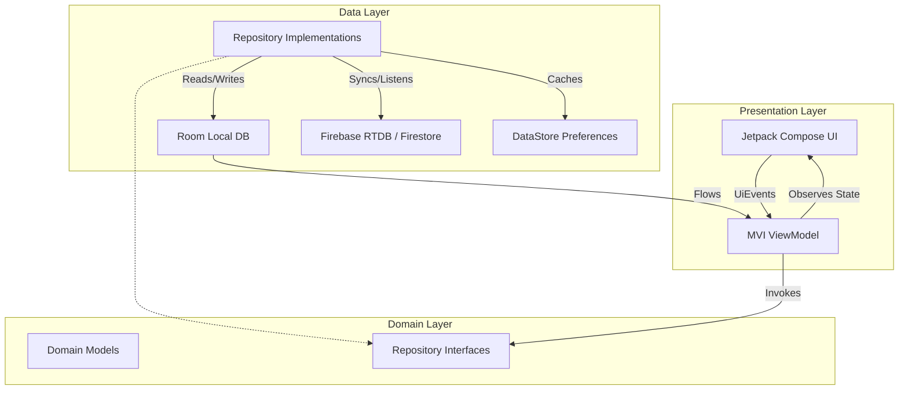
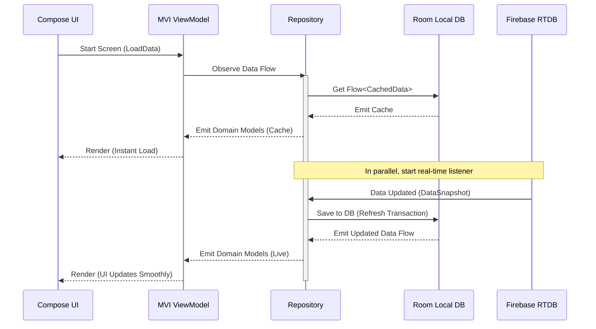

# 🎓 MSU TJ - University Schedule App


**MSU TJ** is a comprehensive mobile application for the Lomonosov Moscow State University (Dushanbe Branch). It empowers both **Students** and **Teachers** with real-time schedule tracking, smart classroom finding, offline schedule access, and instant university alerts.

---

## ✨ Key Features

* **👥 Role-Based Experience:**
    * **Students:** Instant access to group schedules and faculty news.
    * **Teachers:** Personalized dashboard with teaching load and topic-based notifications.
* **📅 Advanced Scheduling (Offline-First):**
    * **Instant Offline Load:** Schedules are cached locally in Room DB. If there is no network, the app works flawlessly using cached data.
    * **Next Week Preview:** Toggle to view the upcoming week's schedule in advance.
    * **Swipe Navigation:** Easily switch between days of the week.
* **🏫 Smart Free Classrooms:** Find available auditoriums filtered by specific time slots. Integrates with schedule "windows" to show free classrooms dynamically.
* **👤 Direct Profile Editing:** Fix typos or update your details (Surname, Name, Patronymic) directly within the app.
* **🔔 Intelligent Notifications:** Targeted alerts based on your role (Student Group or Teacher Staff) cached locally with an optimistic UI update pattern.

---

## 📱 Screenshots

|                   Schedule                    |                   Free Rooms                   |                   Teacher                    |                   Notifications                    |
|:---------------------------------------------:|:----------------------------------------------:|:--------------------------------------------:|:--------------------------------------------------:|
|  |  |  |  |

---

## 🏗 System Architecture

The application is built using **Clean Architecture** principles combined with an **MVI (Model-View-Intent)** presentation layer to ensure clear separation of concerns, testability, and a unidirectional data flow (UDF).


```mermaid
graph TD
    subgraph Presentation Layer
        UI[Jetpack Compose UI]
        VM[MVI ViewModel]
    end
    subgraph Domain Layer
        Model[Domain Models]
        RepoIntf[Repository Interfaces]
    end
    subgraph Data Layer
        RepoImpl[Repository Implementations]
        Room[Room Local DB]
        Firebase[Firebase RTDB / Firestore]
        Pref[DataStore Preferences]
    end

    UI -->|UiEvents| VM
    VM -->|Observes State| UI
    VM -->|Invokes| RepoIntf
    RepoImpl -.-> RepoIntf
    RepoImpl -->|Reads/Writes| Room
    RepoImpl -->|Syncs/Listens| Firebase
    RepoImpl -->|Caches| Pref
    Room -->|Flows| VM
```

### 🔄 Offline-First Sync Flow

The app treats the **Room Database** as the Single Source of Truth. When a user requests data, the cached values are delivered instantly, while a background Firebase connection fetches updates and saves them directly to Room:


```mermaid
sequenceDiagram
    participant UI as Compose UI
    participant VM as MVI ViewModel
    participant Repo as Repository
    participant Room as Room Local DB
    participant Firebase as Firebase RTDB

    UI->>VM: Start Screen (LoadData)
    VM->>Repo: Observe Data Flow
    activate Repo
    Repo->>Room: Get Flow<CachedData>
    Room-->>Repo: Emit Cache
    Repo-->>VM: Emit Domain Models (Cache)
    VM-->>UI: Render (Instant Load)
    
    Note over Repo,Firebase: In parallel, start real-time listener
    Firebase->>Repo: Data Updated (DataSnapshot)
    Repo->>Room: Save to DB (Refresh Transaction)
    Room-->>Repo: Emit Updated Data Flow
    Repo-->>VM: Emit Domain Models (Live)
    VM-->>UI: Render (UI Updates Smoothly)
    deactivate Repo
```

---

## 🛠 Tech Stack

* **Language:** Kotlin
* **UI:** Jetpack Compose (Material Design 3)
* **DI:** Koin (using KSP compiler annotation bindings)
* **Concurrency:** Kotlin Coroutines & Flow
* **Database:** Room DB (with indexes optimized for quick schedule/notification lookups)
* **Key-Value Store:** Jetpack DataStore Preferences
* **Backend:** Firebase (Authentication, Realtime Database, Cloud Firestore, Cloud Messaging)
* **Testing:** JUnit 5, MockK, Coroutines Test, Turbine

---

## 🚀 Getting Started & Local Setup

### 📋 Prerequisites
1. Clone the repository:
   ```bash
   git clone https://github.com/yusufjon-developer/msu-tj-android.git
   ```
2. Place your `google-services.json` inside the `app/` directory.

### 🔑 Google Sign-In Configuration
To run Google Sign-In locally on your development machine, you must register your debug keystore SHA-1 fingerprint in your Firebase project console:

1. **Extract your SHA-1 fingerprint:**
   * **Windows:**
     ```bash
     keytool -list -v -alias androiddebugkey -keystore %USERPROFILE%\.android\debug.keystore -storepass android
     ```
   * **macOS/Linux:**
     ```bash
     keytool -list -v -alias androiddebugkey -keystore ~/.android/debug.keystore -storepass android
     ```
2. Go to **Firebase Console -> Project Settings -> General**.
3. Under **Your Apps -> tj.msu**, click **Add Fingerprint** and paste your SHA-1.
4. Download the updated `google-services.json` and replace it in the `app/` folder.

---

## 🧪 Running Tests

Unit tests are written using JUnit 5, MockK, and Turbine to test ViewModel state transitions and data mappers.

To run tests:
```bash
./gradlew testDebugUnitTest
```
